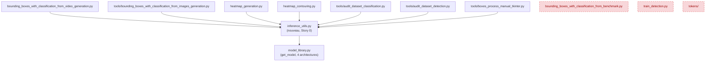

# Architecture Spine — Refactor JAX_Detection — module d'inférence mutualisé

## Design Paradigm

Le pipeline d'entraînement (`main.py`/`Trainer`/`TaskStrategy`/`model_library.get_model()`) reste **Strategy + Factory + Dependency Injection**, inchangé par ce refactor (NFR2) — aucune de ses briques n'est touchée. Ce spine ajoute un seul nouveau pattern, cohérent avec l'organisation plate existante (aucun package, modules racine) : un **Shared Utility Module** — `inference_utils.py` — qui devient l'unique source des fonctions d'inférence transverses (chargement de checkpoints, prétraitement, prédiction, décodage de détection, NMS/IoU). Les scripts consommateurs (racine et `tools/`) importent depuis ce module au lieu de redéfinir. `JAX_KEPLER` (NFR1) ne dépend d'aucune de ces fonctions d'inférence image (`decode_segmentation_and_detect*`, `predict_crop*`) — sa généricité est préservée par construction : ce refactor ne touche à rien de ce que `KeplerStrategy`/`kepler_1d_cnn` utilisent.

## Invariants & Rules

### AD-1 — `inference_utils.py` comme source unique des helpers d'inférence

- **Binds:** FR1, FR2, FR10
- **Prevents:** la redéfinition locale d'une fonction d'inférence dans plusieurs fichiers (la dette que ce refactor élimine), y compris les familles de duplication non détectées par la simple recherche par nom identique de `dead-code-and-duplication-audit.md`.
- **Rule:** les fonctions suivantes existent en un seul exemplaire chacune dans `inference_utils.py` ; tout fichier qui en a besoin importe, aucune redéfinition locale (y compris sous un autre nom faisant le même travail) n'est autorisée :
  1. `load_jax_model(checkpoint_path, config)` → `(model, variables, mean, std)`
  2. `load_detection_model(checkpoint_path)` → `(model, variables, config_model)`
  3. `predict_crop(crop_img, model, variables, mean, std, config)` — image unique, non-JIT (AD-2)
  4. `predict_crops_batch(crop_imgs, predict_fn, mean, std, config)` — batch + `predict_fn` précompilé (AD-2)
  5. `build_predict_fn(model, variables)` — wrapper JIT générique, sortie brute (consolide `build_det_predict_fn` et le `build_predict_fn` local de `tools/audit_dataset_classification.py`, structurellement identiques)
  6. `build_clf_predict_fn(model, variables)` — wrapper JIT avec softmax+argmax intégrés (contrat de sortie différent de (5), reste distinct)
  7. `get_iou(box1, box2)`
  8. `non_max_suppression(boxes, iou_threshold)`
  9. `_preprocess_crop_to_hwc(crop_img, mean, std, config)`
  10. `decode_segmentation_and_detect(img_bgr, model, variables, config_model, conf_threshold, box_aera_min)` — image unique, pleine résolution (AD-6)
  11. `decode_segmentation_and_detect_batch(frames_bgr, predict_fn, config_model, conf_threshold, box_aera_min)` — batch, basse résolution + projection HD (AD-6)
- **Note d'implémentation** : `tools/audit_dataset_classification.py` n'a pas d'équivalent à migrer pour sa fonction locale `load_classification_model` — son rôle (charger le modèle **et** construire un `predict_fn` prêt à l'emploi) devient une composition explicite au site d'appel : `model, variables, mean, std = load_jax_model(...)` puis `predict_fn = build_predict_fn(model, variables)`, plutôt qu'une 12ᵉ fonction nommée.

### AD-2 — Double API pour la prédiction de crop `[ADOPTED]`

- **Binds:** FR1, FR3, NFR3
- **Prevents:** soit forcer les appelants simples (traitement d'image statique) à gérer une fonction JIT précompilée qu'ils n'ont pas besoin de connaître, soit dégrader le débit temps réel du pipeline vidéo en le ramenant à un traitement image-par-image.
- **Rule:** `predict_crop(crop_img, model, variables, mean, std, config)` (ratifie `tools/bounding_boxes_with_classification_from_images_generation.py:128`, actuellement appelée en usage réel) et `predict_crops_batch(crop_imgs, predict_fn, mean, std, config)` (ratifie `bounding_boxes_with_classification_from_video_generation.py:214`, nom de paramètre exact) sont **deux implémentations pleinement indépendantes** — `predict_crop` n'appelle **pas** `predict_crops_batch` en interne (l'ancienne formulation de cette règle suggérait une délégation qui ne compose pas sans coût de re-JIT par appel ; abandonnée). L'ancien `predict_crop(crop_img, predict_fn, mean, std, config)` de `video_generation.py` (mort — aucun appelant dans tout le repo, vérifié) n'est pas migré. Le chunk-size de padding de `predict_crops_batch` (`CLF_BATCH_SIZE = 32` dans `video_generation.py`) devient une constante privée `_CLF_BATCH_SIZE = 32` dans `inference_utils.py` — les appelants à petits batches irréguliers (outils d'annotation) sont paddés à cette taille comme aujourd'hui, compromis assumé plutôt qu'accidentel.

### AD-3 — `load_detection_model` : robustesse uniformisée `[ADOPTED]`

- **Binds:** FR1, FR3, NFR4
- **Prevents:** la dégradation silencieuse des prédictions quand un checkpoint ne contient pas de `batch_stats` sauvegardés (les BatchNorm restent alors à 0/1 sans avertissement) — fragilité confirmée dans `heatmap_generation.py`/`heatmap_contouring.py` (aucun fallback, `raise` immédiat, pas de ré-init).
- **Rule:** la version canonique conserve le fallback de résolution de chemin à 3 niveaux (CWD → parent du CWD → parent du fichier appelant) **et** la ré-initialisation de structure des `batch_stats` manquants. `DETECTION_IMAGE_SIZE = (224, 224)` (identique dans les 2 copies existantes) devient une constante privée de `inference_utils.py`, utilisée par le chemin de ré-init.

### AD-4 — Pas de référence résiduelle à un modèle mort

- **Binds:** FR1, FR5, FR6
- **Prevents:** un crash (`ValueError` de `get_model()`) si le fallback `model_name` par défaut se déclenche sur un checkpoint sans métadonnées `config`.
- **Rule:** tout fallback `model_name` par défaut dans `inference_utils.py` pointe vers `aircraft_detector_unet` (vivant), jamais vers `aircraft_detector_v3`/`aircraft_detector_v7_advanced` (supprimés par FR5). **Prérequis avant d'exécuter FR5** : vérifier explicitement (FR6) que `best_model.pkl`/`best_model_detection.pkl` ne dépendent d'aucune architecture supprimée — vérification faite en amont de ce spine (`best_model.pkl` → `sophisticated_cnn_128_plus`, `best_model_detection.pkl` → `aircraft_detector_unet`, tous deux dans les 4 survivants), mais FR6 reste un **gate bloquant à ré-exécuter** avant la suppression effective, pas une simple note informative.

### AD-5 — `bounding_boxes_with_classification_from_benchmark.py` supprimé, pas réconcilié

- **Binds:** FR2 (périmètre révisé), FR5, FR9
- **Prevents:** de traiter comme une "divergence de style" une logique de décodage (`decode_grid_and_detect`, NMS vectorisée numpy) qui appartient en réalité aux modèles grid-based `aircraft_detector_v3`/`v7_advanced` supprimés par FR5.
- **Rule:** ce fichier est supprimé intégralement (FR9), au même titre que `train_detection.py` (FR7) et `tokens/` (FR8) — pas migré vers `inference_utils.py`. Confirmé : aucun autre fichier du repo n'importe depuis lui.

### AD-6 — Double API pour le décodage de détection par segmentation `[ADOPTED]`

- **Binds:** FR1, FR3, NFR3
- **Prevents:** dégrader la précision de l'outil image (`decode_segmentation_and_detect`, pleine résolution, double seuil) en le ramenant à la basse résolution du pipeline vidéo, ou dégrader le débit temps réel vidéo (`decode_segmentation_and_detect_batch`, prioritaire — cf. Design Paradigm) en le forçant vers un traitement pleine résolution non batché.
- **Rule:** les deux fonctions restent distinctes et indépendantes dans `inference_utils.py`, chacune ratifiant son implémentation actuelle sans modification de comportement — ce n'est pas une divergence accidentelle mais un vrai compromis résolution/précision vs vitesse, non trivialement unifiable (contrairement à `predict_crop`, il ne s'agit pas juste d'un batch-size, mais d'une différence d'algorithme de binarisation/morphologie). **Le pipeline vidéo est prioritaire** : aucun changement futur à `decode_segmentation_and_detect_batch` ne doit dégrader son débit temps réel au nom d'une unification avec la version image.

### AD-7 — Séquencement : `inference_utils.py` a un auteur unique

- **Binds:** FR1, FR2, FR10
- **Prevents:** 7 stories parallèles (5 fichiers consommateurs + 2 nouveaux, voir AD-8) qui écriraient chacune une version différente du même fichier partagé, avec écrasement silencieux ou conflit sans règle d'arbitrage — risque réel en l'absence de suite de tests (PRD Non-Goals).
- **Rule:** une story dédiée ("Story 0") crée `inference_utils.py` avec les 11 fonctions canonisées (AD-1) et leurs corps définitifs, **avant** que toute story de migration de fichier consommateur ne démarre. Les stories suivantes ne font qu'importer ; aucune n'édite `inference_utils.py` pour y ajouter ou modifier une fonction.

### AD-8 — Périmètre étendu aux consommateurs invisibles

- **Binds:** FR2 (périmètre révisé), FR10
- **Prevents:** une casse silencieuse de `tools/audit_dataset_detection.py` et `tools/boxes_process_manual_tkinter.py`, qui importent aujourd'hui directement depuis l'espace de noms de `bounding_boxes_with_classification_from_video_generation.py` (`load_detection_model`, `get_iou`, `decode_segmentation_and_detect_batch`, `load_jax_model`, `predict_crops_batch` selon le fichier) — invisibles au scope initial du PRD, découverts en phase Architecture.
- **Rule:** ces deux fichiers sont ajoutés à la liste des consommateurs de `inference_utils.py` (FR10) — leurs imports sont repointés vers le nouveau module dans le même cycle, pas laissés à un shim de compatibilité.

### Dépendances (qui peut dépendre de qui)



## Consistency Conventions

| Concern | Convention |
| --- | --- |
| Naming (fonctions transverses) | Toute fonction utilisée par ≥2 fichiers pour l'inférence (chargement, prétraitement, décodage, NMS/IoU) vit dans `inference_utils.py` — jamais redéfinie localement, même sous un autre nom (AD-1, AD-7). |
| Format des boxes | `[x1, y1, x2, y2, score]`, format liste (pas numpy vectorisé) — seul survivant après AD-5. |
| Checkpoints / robustesse | Tout chargement de checkpoint applique le fallback de chemin 3 niveaux + ré-init des `batch_stats` manquants (AD-3) — jamais un chargement "nu" qui échoue silencieusement. |
| Constantes de configuration | `_CLF_BATCH_SIZE`, `DETECTION_IMAGE_SIZE` : privées à `inference_utils.py`, jamais redéfinies dans un fichier consommateur (AD-2, AD-3). |
| Priorité de performance | En cas d'arbitrage entre le pipeline vidéo temps réel et un autre consommateur, le pipeline vidéo est prioritaire (AD-6, NFR3). |

## Stack

Aucune nouvelle dépendance externe introduite — `inference_utils.py` réutilise exclusivement JAX/Flax/NumPy/OpenCV déjà présents dans le projet (voir `docs/architecture.md`).

## Structural Seed

```text
JAX_Detection/
  inference_utils.py          # NOUVEAU (Story 0, AD-7) — 11 fonctions canoniques (AD-1)
  model_library.py            # réduit : 4 architectures vivantes (sophisticated_cnn_128_plus, aircraft_detector_unet, aircraft_detector_miniunet, kepler_1d_cnn), 18 supprimées
  dataset_configs.py          # réduit : 3 configs (FIGHTERJET_CLASSIFICATION, FIGHTERJET_DETECTION, JAX_KEPLER), 4 supprimées
  bounding_boxes_with_classification_from_video_generation.py   # importe depuis inference_utils.py
  bounding_boxes_with_classification_from_benchmark.py          # SUPPRIMÉ (AD-5, FR9)
  heatmap_generation.py       # importe depuis inference_utils.py
  heatmap_contouring.py       # importe depuis inference_utils.py
  train_detection.py          # SUPPRIMÉ (FR7)
  tokens/                     # SUPPRIMÉ (FR8)
  tools/
    bounding_boxes_with_classification_from_images_generation.py  # importe depuis inference_utils.py
    audit_dataset_classification.py                                # importe depuis inference_utils.py ; load_classification_model retiré (composé depuis load_jax_model + build_predict_fn)
    audit_dataset_detection.py                                     # importe depuis inference_utils.py (AD-8, était invisible au PRD initial)
    boxes_process_manual_tkinter.py                                # importe depuis inference_utils.py (AD-8, était invisible au PRD initial)
```

## Deferred

- **Documentation visuelle complète du projet (.puml, tous modèles/scripts)** — vision exprimée par l'utilisateur, explicitement hors scope de ce spine (feature-altitude, pas initiative-altitude). Piste à reprendre dans un futur cycle, probablement via `bmad-agent-tech-writer` (action Mermaid Generate) ou un chantier dédié.
- **Restructuration du système de configuration** (fichier dédié par config) — déjà différée dans `addendum.md` du PRD, non repris ici.
- **Absence de CI/CD et de suite de tests automatisée** — dimension délibérément non couverte par ce spine, héritée du PRD (voir `_bmad-output/planning-artifacts/prds/prd-JAX_Detection-2026-07-12/prd.md` § Non-Goals). C'est précisément ce qui rend AD-7 (auteur unique de `inference_utils.py`) et le Goal 1 du PRD (baseline/diff manuelle) nécessaires en compensation.

### Ajouts post-rétrospective refactor inférence (2026-07-12)

Items exprimés par l'utilisateur lors de la rétrospective de fin de cycle (Epics 1-3, refactor `inference_utils.py`). Listés et enregistrés à ce stade, pas encore instruits — l'utilisateur a explicitement demandé l'avis d'un rôle architecte (`bmad-agent-architect`, Winston) ou d'une revue technique dédiée avant d'agir sur chacun.

**Nouvelle initiative (altitude produit, pas un simple item différé)**

- **Généralisation complète du pipeline** : le code devrait fonctionner avec n'importe quel format d'input/output (au-delà de la détection/classification d'avions), à charge de l'utilisateur d'adapter les fonctions de génération `.npz` et de loss — le `Trainer` devant rester identique. Validation prévue via l'ajout de jeux de données de test standards et légers (CIFAR-10, cat-vs-dog) pour itérer rapidement en end-to-end sans dépendre du dataset de détection complet (~10 Go).
- **Renommage du projet** `JAX_Detection` → `jax_supervised_training` (ou équivalent), conséquence directe de la généralisation ci-dessus. À traiter comme sa propre initiative (probablement `bmad-product-brief` ou `bmad-prd`), pas comme un item de dette technique — impacte l'identité du dépôt, les chemins, la documentation, potentiellement les checkpoints/configs existants.

**Dette technique / qualité de code**

- Documentation du code très limitée à ce jour.
- Mélange français/anglais dans le code et les commentaires — anglicisation à faire.
- Absence de convention de nommage cohérente (snake_case vs camelCase, nommage des fichiers `.py`) — audit de style à mener.
- Réorganisation des `.py` en répertoires logiques (ex. `lib/`, `tools/`) plutôt que la structure plate actuelle.
- Code inutile résiduel au-delà de ce refactor (ex. tout ce qui reste lié à Letterbox) — nécessite un audit fichier par fichier, pas une suppression mécanique par mot-clé.
- Warnings à corriger sur Colab : `WARNING: All log messages before absl::InitializeLog() is called are written to STDERR`, `Could not find cuda drivers on your machine`, `failed call to cuInit: INTERNAL: CUDA error ... UNKNOWN ERROR (303)`.

**Tests**

- Suite de tests unitaires — cf. Non-Goal déjà noté ci-dessus, avec un motif concret désormais identifié : un test manuel a récemment tourné sur l'intégralité du dataset de détection (~10 Go) faute d'un jeu de test léger dédié.
- Jeux de données de test standards et légers (CIFAR-10, cat-vs-dog) — voir "Généralisation" ci-dessus, sert à la fois les tests et la validation de la généricité du pipeline.

**Performance**

- Optimisation de la consommation GPU/TPU sur Colab (observé : 24.9/47.0 Go RAM, 31.2/225.3 Go disque) — étudier les leviers disponibles (taille de batch notamment) pour accélérer l'entraînement sans dégrader les performances actuelles ; noter que l'augmentation de la taille de batch n'est pas systématiquement bénéfique.
- Optimisation des modèles : viser une empreinte plus légère à performance égale.
