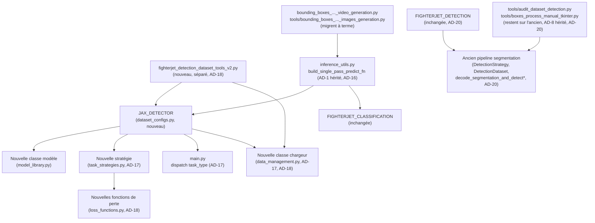

# Architecture Spine — JAX Single-Pass — pipeline unifié détection+classification

## Design Paradigm

L'entraînement reste **Strategy + Factory + Dependency Injection** (`main.py`/`Trainer`/`TaskStrategy`/`model_library.get_model()`), hérité et inchangé — `JAX_DETECTOR` s'y insère comme une nouvelle stratégie/classe/config, pas une exception au pattern. `inference_utils.py` reste le **Shared Utility Module** unique pour les fonctions d'inférence transverses (AD-1 hérité) — la composition JAX Single-Pass y vit pour la même raison que tout le reste, pas par choix isolé.

La vraie nouveauté architecturale de ce spine : un **Pipes-and-Filters** pour la composition d'inférence — une chaîne de filtres purs, chacun JIT-compilable, sans état mutable partagé entre eux (`RESIZE → détecteur (poids figés) → extraction de pics → Top-K → RESCALE → CROP → classifieur (poids figés)`). Ce pattern n'existe qu'à l'inférence ; l'entraînement de `JAX_DETECTOR` et de `FIGHTERJET_CLASSIFICATION` reste modulaire et séparé (AD-6).

## Inherited Invariants

| Inherited | From parent | Binds here |
| --- | --- | --- |
| AD-1 | architecture-JAX_Detection-2026-07-12 | `inference_utils.py` reste la source unique des helpers d'inférence — `build_single_pass_predict_fn` s'y ajoute, aucune redéfinition locale ailleurs. |
| AD-2 [ADOPTED] | architecture-JAX_Detection-2026-07-12 | Précédent de double API (image unique vs batch, pas de délégation interne) à considérer si `build_single_pass_predict_fn` a besoin d'une variante image unique. |
| AD-3 [ADOPTED] | architecture-JAX_Detection-2026-07-12 | Tout chargement de checkpoint (dont le nouveau `JAX_DETECTOR`) applique le fallback de chemin 3 niveaux + réinit des `batch_stats` manquants — jamais un chargement nu. |
| AD-6 [ADOPTED] | architecture-JAX_Detection-2026-07-12 | Principe préservé (pas les fonctions, remplacées) : le débit temps réel du pipeline vidéo est prioritaire — `build_single_pass_predict_fn` ne le dégrade pour aucune autre considération. |
| AD-7 | architecture-JAX_Detection-2026-07-12 | Pattern de séquencement réutilisé : une story dédiée crée `build_single_pass_predict_fn` et la nouvelle classe/stratégie détection avant toute story consommatrice — pas de suite de tests automatisée pour arbitrer un conflit d'édition parallèle. |
| AD-8 | architecture-JAX_Detection-2026-07-12 | Le périmètre des consommateurs inclut les fichiers `tools/` invisibles à une lecture superficielle. Vérifié pour ce spine : `tools/audit_dataset_detection.py` et `tools/boxes_process_manual_tkinter.py` consomment `decode_segmentation_and_detect(_batch)` en plus des 2 fichiers déjà connus — restent sur l'ancien pipeline tant que non explicitement migrés (voir Deferred). |

`AD-4` (fallback modèle mort) et `AD-5` (benchmark.py resté supprimé) du parent ne sont pas hérités ici : ni l'un ni l'autre n'est touché par ce chantier, aucun risque de divergence à fixer.

**Note de numérotation :** ce spine hérite des identifiants `AD-1` à `AD-8` du parent (table ci-dessus) et démarre sa propre numérotation à `AD-9` pour éviter toute collision d'ID au sein d'un même document — `AD-3`, par exemple, ne désigne jamais deux règles différentes ici.

## Invariants & Rules

### AD-9 — Détection par point central (anchor-free), pas segmentation+contours

- **Binds:** `JAX_DETECTOR` (modèle et pipeline de décodage)
- **Prevents:** dépendance à `cv2.findContours` (non JAX-native, bloquant pour un graphe unifié) ; fusion de boîtes proches/superposées, inhérente à l'extraction de composantes connexes sur un masque de segmentation.
- **Rule:** `JAX_DETECTOR` prédit un heatmap de centres + une régression de taille par position (jamais un masque de segmentation plein format). L'extraction de boîtes est 100% JAX-native : maxima locaux par max-pooling (`jax.lax.reduce_window`) + sélection Top-K=20 (`jax.lax.top_k`) — `cv2.findContours`/morphologie/NMS-python ne sont jamais utilisés sur ce chemin.

### AD-10 — Backbone/FPN reporté, pas adopté

- **Binds:** `JAX_DETECTOR`
- **Prevents:** complexité et risque d'entraînement ajoutés sans preuve de nécessité mesurée.
- **Rule:** l'encodeur de `JAX_DETECTOR` reste dans la même famille que l'`AircraftDetectorUNet` actuel (encoder-decoder simple, pas de backbone+FPN). Ne reconsidérer que si la détection de petits avions distants s'avère concrètement insuffisante en test réel — pas par anticipation.

### AD-11 — Crop différentiable par grid-sample continu, déterministe

- **Binds:** composition d'inférence (`build_single_pass_predict_fn`)
- **Prevents:** dépendance à une découpe discrète cv2 dans le graphe d'inférence ; sur-ingénierie d'un sous-réseau appris là où une fonction pure suffit.
- **Rule:** le recadrage de chaque détection est `jax.scipy.ndimage.map_coordinates` (interpolation bilinéaire), fonction pure des coordonnées de boîte déjà connues — jamais un sous-réseau appris. `vmap` sur un axe fixe de 20 slots pour paralléliser sans boucle Python.

### AD-12 — Résolution d'entrée canonique et double branche interne

- **Binds:** composition d'inférence
- **Prevents:** ambiguïté sur la résolution d'entrée du graphe ; perte de détail dans les crops si un seul flux basse résolution (224×224) servait à la fois la détection et le recadrage ; désynchronisation si la résolution du détecteur change un jour (AD-10, Deferred) sans que `RESIZE` suive.
- **Rule:** l'entrée canonique du graphe est 1920×1080 grayscale — toute source non conforme est normalisée en Python en amont (normalisation d'E/S, hors du périmètre "zéro Python" de la logique d'inférence elle-même). En interne, deux branches dérivées de cette unique entrée : `RESIZE` déterministe vers la résolution du détecteur pour la branche détection, image pleine résolution conservée pour le `CROP`. `RESIZE` **dérive toujours sa taille cible de la clé `image_size` de la config `JAX_DETECTOR`** (jamais un littéral 224×224 codé en dur indépendamment) — un builder qui change la résolution d'entraînement du détecteur ne peut pas désynchroniser la composition.

### AD-13 — RESCALE symétrique entre décodage et recadrage

- **Binds:** composition d'inférence
- **Prevents:** coordonnées de boîte dans le mauvais repère au moment d'échantillonner l'image source pour le crop ; un builder du décodage (pics + Top-K) et un builder de `RESCALE` supposant chacun un stride/résolution de sortie du détecteur différent, sans qu'aucune incohérence ne fasse planter quoi que ce soit — juste des boîtes fausses.
- **Rule:** la résolution spatiale de sortie du heatmap de `JAX_DETECTOR` (stride du détecteur — ex. pleine résolution d'entrée ou un sous-échantillonnage fixe) est une **unique valeur nommée**, définie une seule fois (constante partagée ou dérivée de la config `JAX_DETECTOR`) et référencée identiquement par l'extraction de pics/Top-K et par `RESCALE` — jamais assumée indépendamment par les deux. Une étape `RESCALE` déterministe ramène ensuite les coordonnées de boîte de ce repère vers le repère image d'origine (1920×1080), avant le `CROP` — symétrique du `RESIZE` d'entrée (AD-12).

### AD-14 — Entraînement modulaire, jamais unifié

- **Binds:** `JAX_DETECTOR`, `FIGHTERJET_CLASSIFICATION`, composition d'inférence
- **Prevents:** besoin d'un dataset d'entraînement full-HD (~41× plus volumineux qu'à 224×224) ; confusion sur ce qui nécessite réellement un (ré)entraînement.
- **Rule:** le graphe unifié n'existe qu'**à l'inférence**. `JAX_DETECTOR` s'entraîne seul, sur des chunks `.npz` classiques à sa résolution de config (comme le pipeline actuel), sans jamais voir de full-HD. `FIGHTERJET_CLASSIFICATION` reste figée et n'est jamais réentraînée par ce chantier.

### AD-15 — Sortie à taille fixe, masque de validité explicite

- **Binds:** composition d'inférence
- **Prevents:** confondre un "slot de détection vide" avec une "prédiction de classe" — un classifieur softmax ne peut jamais retourner "rien", il produit toujours une distribution pleine même sur du bruit ; un consommateur qui filtre les slots invalides autrement que via `valid_mask` (ex. `box.sum() > 0`) et laisse fuiter des détections fantômes ; deux builders choisissant chacun leur propre seuil ou leur propre emplacement pour la valeur de seuil de détection.
- **Rule:** la sortie de `build_single_pass_predict_fn` est `{boxes, classes, class_scores, detection_scores, valid_mask}`, toujours 20 slots (taille fixe). Les slots invalides sont remplis à **zéro** dans tous les champs (jamais `NaN`, jamais `-1`) — `valid_mask` reste la seule autorité pour distinguer un slot réel d'un slot vide, jamais une valeur dérivée d'un autre champ. `valid_mask` est dérivé du score de détection (confiance du pic sur le heatmap) comparé à un **seuil défini une seule fois, dans la config `JAX_DETECTOR`** (`dataset_configs.py`, lu via `get_dataset_config()`) — jamais une constante privée dupliquée dans `inference_utils.py` ou ailleurs (cf. `deferred-work.md`, item déjà identifié sur `_CLF_BATCH_SIZE`/`_DET_BATCH_SIZE` dupliqués : même risque, à ne pas répéter ici).

### AD-16 — Deux configs distinctes ; la composition n'est pas une config

- **Binds:** `dataset_configs.py`, `inference_utils.py`
- **Prevents:** forcer une composition à deux modèles dans une abstraction (`validate_config`, `DATASET_CONFIGS`) conçue pour exactement un modèle et un dataset entraînables.
- **Rule:** `JAX_DETECTOR` est une entrée `DATASET_CONFIGS` standard (comme `FIGHTERJET_CLASSIFICATION`) — un modèle, un dataset, un entraînement. La composition JAX Single-Pass n'en est **pas** une : elle vit comme fonction `build_single_pass_predict_fn` dans `inference_utils.py`, qui lit `JAX_DETECTOR` et `FIGHTERJET_CLASSIFICATION` via `get_dataset_config()` sans les modifier, charge les deux checkpoints figés, et assemble les couches déterministes en un callable JIT unique.

### AD-17 — Nouveau format de tâche = nouvelle classe dédiée, jamais une branche conditionnelle, dispatch unique

- **Binds:** `task_strategies.py`, `data_management.py`, `main.py`
- **Prevents:** une classe existante (`DetectionStrategy`, `DetectionDataset`) qui devient un maquis de branches par format de tâche, difficile à raisonner et à faire évoluer indépendamment ; deux builders faisant vivre le même `task_type` sous deux littéraux différents dans deux (ou trois) points de dispatch distincts, avec pour conséquence un `ValueError` ou un mauvais aiguillage silencieux.
- **Rule:** ratifie le pattern déjà établi dans le code (`ClassificationStrategy`/`DetectionStrategy` séparées ; `ChunkManager`/`DetectionDataset` séparées, dispatchées par `task_type` — vérifié `data_management.py:429-463`). Le format heatmap+taille obtient sa propre classe de stratégie et sa propre classe de chargeur de données ; `DetectionStrategy` et `DetectionDataset` existantes restent inchangées, dédiées à l'approche segmentation. Le littéral `task_type` qui identifie ce nouveau format est défini **une seule fois** et référencé identiquement aux **trois** points de dispatch existants : `task_strategies.py`, `data_management.py`, **et `main.py`** (`main.py:107-143` — point de dispatch réel, absent d'une première version de ce spine, à corriger dans le seed).

### AD-18 — Format d'échange heatmap+taille à source unique

- **Binds:** `fighterjet_detection_dataset_tools_v2.py` (producteur), nouvelle classe `data_management.py` (consommateur), `loss_functions.py` (consommateur)
- **Prevents:** le producteur et les consommateurs du format `.npz` heatmap+taille (noms de clés, formes de tableaux, unités, formule du rayon gaussien du pic) chacun réinventant sa propre hypothèse de format de façon indépendante mais mutuellement incompatible — aucun des deux ne « casse » individuellement, seule la lecture croisée échoue ou produit un entraînement silencieusement faux.
- **Rule:** l'encodage/décodage des cibles heatmap+taille (noms de clés du `.npz`, formes, unités, formule du rayon gaussien) est défini par un **unique module ou une paire de fonctions partagées** (encode côté outil de préparation, decode côté chargeur), importées par `fighterjet_detection_dataset_tools_v2.py` et par la nouvelle classe de `data_management.py` — jamais réimplémentées indépendamment de chaque côté. La valeur exacte du schéma (noms de clés, shapes) reste à fixer au niveau story ; ce que ce spine fixe, c'est qu'elle n'existe qu'à un seul endroit.

### AD-19 — Grid-based/YOLO à ancres reporté, pas abandonné

- **Binds:** portée du chantier
- **Prevents:** répéter l'échec historique du grid-based sous une forme différente — le volume global de données n'est plus limitant, mais le signal d'entraînement spécifique au chevauchement (~1.36% des images, une fraction encore plus faible se touchant réellement) reste quasi inexistant ; adopter une architecture à ancres pour un gain sur le chevauchement qu'elle n'apporterait pas structurellement mieux qu'un point central tant que ce signal manque.
- **Rule:** AD-9 (point central) reste l'approche retenue pour ce chantier — elle correspond mieux à la topologie du problème (un centre par objet, indépendant du chevauchement) que le grid-based, indépendamment même de la question de volume de données. Le chevauchement d'avions proches est une limite connue et acceptée, pas bloquante. Ne pas reconsidérer une architecture par ancres sans une stratégie de données synthétiques dédiée (composition d'images) au chevauchement — sous-projet à part entière, pas un changement d'architecture isolé.

### AD-20 — Non-régression : l'ancien pipeline reste pleinement fonctionnel, en parallèle

- **Binds:** `FIGHTERJET_DETECTION` (config `dataset_configs.py`), `AircraftDetectorUNet` (modèle, `model_library.py`), `DetectionStrategy`, `DetectionDataset`, `decode_segmentation_and_detect(_batch)`, `fighterjet_detection_dataset_tools.py`, `tools/audit_dataset_detection.py`, `tools/boxes_process_manual_tkinter.py`
- **Prevents:** perte de la capacité de revenir à l'ancien pipeline (entraînement UNet + décodage segmentation + python/cv2) si `JAX_DETECTOR`/JAX Single-Pass s'avère être une impasse en production — le motif explicite de cette règle. Un builder qui, pensant l'ancien pipeline "remplacé", le modifie, le supprime, ou casse son entraînement/inférence de bout en bout pendant ce chantier.
- **Rule:** `FIGHTERJET_DETECTION`, `AircraftDetectorUNet`, `DetectionStrategy`, `DetectionDataset`, `decode_segmentation_and_detect(_batch)`, `fighterjet_detection_dataset_tools.py`, et tous leurs consommateurs (`tools/audit_dataset_detection.py`, `tools/boxes_process_manual_tkinter.py`, et les deux scripts `bounding_boxes_with_classification_from_*` tant qu'ils n'ont pas explicitement migré) restent utilisables **de bout en bout — entraînement ET inférence — sans modification fonctionnelle**, pendant toute la durée de ce chantier et après sa clôture. `JAX_DETECTOR` et `build_single_pass_predict_fn` s'ajoutent strictement **en parallèle** ; aucune story de cette epic ne supprime, ne renomme, ni ne modifie le comportement de l'ancien pipeline. Une éventuelle dépréciation de l'ancien pipeline est une décision séparée, explicite, hors du périmètre de cette epic.

### Dépendances (qui peut dépendre de qui)



## Consistency Conventions

| Concern | Convention |
| --- | --- |
| Naming | `JAX_DETECTOR` (config, majuscules, cohérent avec `FIGHTERJET_CLASSIFICATION`/`JAX_KEPLER`) ; `build_single_pass_predict_fn` (préfixe `build_*`, cohérent avec `build_predict_fn`/`build_clf_predict_fn` hérités) ; `fighterjet_detection_dataset_tools_v2.py` (suffixe `_v2`, fichier original non touché). |
| Format des boîtes | Ancien pipeline : liste `[x1, y1, x2, y2, score]` (hérité, inchangé, AD-5 parent). Nouveau pipeline JAX Single-Pass : tableaux JAX à taille fixe `(20, 4)` boîtes + `(20,)` scores/classes/masque — divergence intentionnelle et nécessaire (JAX ne manipule pas de listes à taille variable). Les deux formats coexistent, strictement scopés à leur pipeline respectif, jamais mélangés dans une même fonction. |
| État & transverse | Aucun gradient ne traverse les poids figés (détecteur entraîné, classifieur) pendant la composition d'inférence — chargement en lecture seule uniquement, robustesse héritée (AD-3 parent). |

## Stack

Aucune nouvelle dépendance externe introduite — `jax.scipy.ndimage.map_coordinates`, `jax.lax.reduce_window`, `jax.lax.top_k` font partie de JAX déjà utilisé par le projet.

## Structural Seed

```text
jax_supervised_training/
  main.py                              # + branche de dispatch task_type (AD-17), même littéral que task_strategies.py/data_management.py
  model_library.py                     # + nouvelle classe modèle (encoder-decoder, tête heatmap+taille)
  task_strategies.py                   # + nouvelle stratégie dédiée (AD-17)
  loss_functions.py                    # + heatmap focal loss + régression de taille (AD-18)
  dataset_configs.py                   # + entrée JAX_DETECTOR ; FIGHTERJET_DETECTION intouchée (AD-20)
  data_management.py                   # + nouvelle classe de chargeur dédiée (AD-17, AD-18) ; DetectionDataset intouchée (AD-20)
  inference_utils.py                   # + build_single_pass_predict_fn, crop&resize JAX, extraction de pics (AD-1 hérité)
  fighterjet_detection_dataset_tools_v2.py   # NOUVEAU — cibles heatmap+taille depuis raw_boxes, pas de masque intermédiaire (AD-18)
  fighterjet_detection_dataset_tools.py      # INTOUCHÉ — sert toujours l'ancien pipeline segmentation, capacité de rollback (AD-20)
  bounding_boxes_with_classification_from_video_generation.py   # migre vers build_single_pass_predict_fn (à terme, jamais forcé — AD-20)
  tools/
    bounding_boxes_with_classification_from_images_generation.py  # idem
    audit_dataset_detection.py                                     # reste sur l'ancien pipeline tant que non migré (AD-8 hérité, AD-20)
    boxes_process_manual_tkinter.py                                # idem
```

## Deferred

- **Méthode de resize pour `RESIZE`** (JAX, full-HD→224×224 à l'inférence) — à valider par parité pixel contre PIL/LANCZOS (utilisé à la préparation du dataset d'entraînement) avant tout entraînement de `JAX_DETECTOR`. Coût de validation faible, pas un blocage de conception.
- **Parité pixel du `CROP`** (`map_coordinates` vs `cv2.resize`, dont dépend le modèle de classification figé) — convention d'alignement pixel (bord vs centre) à vérifier précisément, pas juste visuellement. Même raison que ci-dessus.
- **Initialisation de l'encodeur de `JAX_DETECTOR`** : aléatoire vs poids de l'`AircraftDetectorUNet` actuel (transfert learning au sens propre) — à tester empiriquement une fois l'entraînement engagé, aucune garantie a priori de compatibilité (encodeur actuel façonné pour une sortie de segmentation dense, pas une tête heatmap+taille ponctuelle).
- **Migration de `tools/audit_dataset_detection.py` et `tools/boxes_process_manual_tkinter.py`** vers `build_single_pass_predict_fn` — pas requise pour ce chantier ; garantie de fonctionnement de l'ancien pipeline pour ces deux outils devenue contraignante (AD-20), pas seulement laissée par défaut.
- **Backbone + Feature Pyramid Network** (AD-10) — reporté, pas abandonné ; revisiter seulement si la détection de petits avions distants s'avère concrètement insuffisante en test réel.
- **Grid-based/YOLO à ancres avec données synthétiques de chevauchement** (AD-19) — sous-projet à part entière si le chevauchement d'avions proches devient un problème réel en usage, pas une extension improvisée de ce chantier.
- **Déploiement / environnement** — hérité du parent sans changement : exécution locale + Colab (GPU/TPU), pas de CI/CD (Non-Goal déjà acté), pas de service déployé séparément. Ce chantier n'introduit aucune nouvelle dimension opérationnelle.
- **Nuance mineure sur la diversité de résolution des images sources d'entraînement** de `JAX_DETECTOR` (vs le ratio de sous-échantillonnage ~8.6× vu à l'inférence) — noté, probablement non significatif, pas d'action prévue sauf signal contraire en test.
- **Roadmap `jax.scipy.ndimage.map_coordinates`** (AD-11) — une JEP JAX propose, non actée à ce jour, de sortir cette fonction du cœur de `jax.scipy.ndimage` vers un paquet séparé (`dm-pix` ou équivalent). Aucune action requise maintenant ; si elle atterrit avant l'implémentation du `CROP`, réévaluer si cela reste "aucune nouvelle dépendance externe" (Stack) ou si ça en introduit une.
- **Budget mémoire du graphe unifié** — déjà tranché en discussion (pas dans un `AD`, rien à contraindre pour un futur builder) : poids figés côte à côte sans duplication, empreinte jugée négligeable voire meilleure que l'actuel (élimination du détour python/cv2 intermédiaire). Noté ici pour ne pas perdre la conclusion, pas un sujet ouvert.
