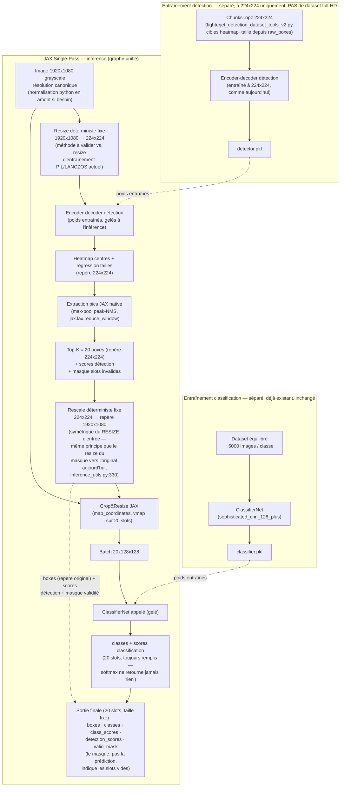

# JAX Single-Pass — Détection + Classification unifiées

**En pause depuis le 2026-07-15** — Aymeric a un autre sujet à traiter d'abord. Aucun epic/story créé pour ce chantier (encore en phase de planification pure), rien à repasser en `backlog` dans `sprint-status.yaml`. Pour reprendre : relire ce document en entier (toutes les décisions et questions ouvertes sont datées), prochaine étape naturelle = `bmad-architecture` pour formaliser en spine, une fois le prototype de validation (`RESIZE`/`RESCALE`/crop, parité pixel) fait ou explicitement sauté.

Nom retenu par Aymeric le 2026-07-14 : **"JAX Single-Pass"** (alias personnel noté : "mini-myc" — à clarifier si ça doit apparaître ailleurs que dans la tête d'Aymeric).

**Statut** : exploration technique, en discussion avec Winston (architecte). Pas encore de décision figée — ce document capture les questions ouvertes autant que les conclusions. Rien n'est acté tant que ce n'est pas explicitement marqué comme tel.

## Contexte / motivation

Pipeline actuel (3 pièces) :
1. `FIGHTERJET_DETECTION` — UNet, segmentation sur image 224×224, jusqu'à 20 avions
2. Python/cv2 intermédiaire — reprend les boxes détectées, recadre dans l'image full-size, produit des crops grayscale 128×128
3. `FIGHTERJET_CLASSIFICATION` — CNN (`sophisticated_cnn_128_plus`) sur les crops 128×128, 32 classes

Deux motivations distinctes qui poussent à repenser ce pipeline :
- **Objectif initial (Aymeric)** : éliminer le python/cv2 intermédiaire, tout faire dans un seul graphe JAX exécutable ("recadrage différentiable directement dans JAX"), classification gardée figée/entraînée séparément (dataset équilibré, contrainte non négociable).
- **Bug réel découvert en cours de discussion** : les boxes d'avions en formation serrée fusionnent (masque binaire → un seul contour pour deux avions qui se touchent) → classification inopérante sur la box fusionnée. Confirmé topologiquement inhérent à l'approche segmentation + `cv2.findContours` (segmentation sémantique ≠ segmentation d'instances), pas un problème de réglage.

## Découverte clé (Winston, en vérifiant le code)

Le "python intermédiaire" que l'idée initiale visait à éliminer n'est pas qu'un crop/resize. `decode_segmentation_and_detect` (`inference_utils.py:297-350`) fait :

```
UNet → masque de probabilité → seuillage → cv2.dilate/erode (morphologie)
     → cv2.findContours (composantes connexes) → cv2.boundingRect → NMS (boucle python)
```

- Morphologie (dilate/erode/close) : portable en JAX (`jax.lax.reduce_window`) — pas un blocage.
- NMS à budget fixe (max 20 boîtes) : portable en JAX (pattern de masquage standard) — pas un blocage.
- **`cv2.findContours` (extraction de composantes connexes) : pas d'équivalent JAX/XLA direct.** C'est le vrai point dur, pas le crop.

## Convergence des deux sujets

Une tête de détection par instances (grille/ancres façon YOLO, ou par point central façon CenterNet) résoudrait les deux problèmes en même temps :
- Sortie de taille fixe nativement → compatible graphe JAX unique, pas besoin de `findContours`
- Détection au niveau de l'objet, pas extraction post-hoc sur un blob → pas de fusion de boxes sur avions proches/superposés

**Conclusion provisoire** : la question "comment éliminer python" et la question "comment corriger la fusion des boxes" ne sont probablement pas deux chantiers séparés, mais une seule et même réponse : redessiner la tête de détection.

## Historique pertinent (à ne pas ignorer)

- Le projet a déjà testé une approche grid-based (`decode_grid_and_detect`, dans `bounding_boxes_with_classification_from_benchmark.py`, supprimé comme code mort à l'Epic 3 — plus aucun fichier ne l'importait à ce moment-là).
- Selon Aymeric : la détection grid-based ne fonctionnait pas bien à l'époque, **principalement à cause d'un volume de données d'entraînement insuffisant**. UNet (segmentation) est venu après et a semblé "plus élégant" — hypothèse de Winston : probablement pas qu'une question de goût, la segmentation donne un signal dense pixel par pixel, plus économe en données que les approches à ancres classiques.
- **Question ouverte, bloquante avant d'aller plus loin sur cette piste** : le volume de données d'entraînement pour la détection a-t-il significativement augmenté depuis cette tentative ? Si non, risque réel de reproduire le même échec avec un grid-based classique.

## Volume de données — confirmé (2026-07-14)

Dataset détection combiné (répertoire détection + répertoire classification fusionnés dans les .npz) : **113 708 images train + 28 965 val = 142 673 total**, largement au-dessus des ~20 000 d'origine qui avaient fait échouer le grid-based.

Distribution par nombre de boxes/image (train) :
- 1 box : 112 163 (**98.6%**)
- 2+ boxes : 1 545 (1.36%) seulement

**Conclusion clé** : le volume global n'est plus un facteur bloquant en général (confirmé par l'utilisateur : "résultats excellents sur images multi-avions" avec le pipeline actuel). Mais le cas précis "avions qui se chevauchent/se touchent" — celui que le grid-based était censé corriger — ne dispose que de quelques dizaines d'exemples d'entraînement réels, noyés dans 113k images à majorité écrasante 1-box. **Aucune architecture (UNet actuel ou grid-based) n'a de signal suffisant pour apprendre spécifiquement ce cas.** Le problème n'est donc plus "quelle architecture" mais "manque de données ciblées sur le chevauchement", commun aux deux options.

## Décision actée (2026-07-14)

Entre les deux options (tenter YOLO/grille 7×7×2 ancres vs avancer sur le pipeline unifié détection/classification) : **avancer sur le pipeline unifié maintenant**, en gardant l'UNet actuel tel quel (chevauchement documenté comme limite connue, pas bloquante — cas rare en pratique). Confirmé par Aymeric. YOLO/grid-based reporté, pas abandonné — à reprendre si une vraie stratégie de données sur le chevauchement se dessine.

Raisons :
- Le pipeline unifié (crop+classification figée dans un graphe JAX) ne dépend pas de résoudre le chevauchement — valeur livrable immédiate, sans pari sur une donnée qui n'existe pas encore.
- Tenter YOLO tel que scopé, sur les mêmes données (quelques dizaines d'exemples de chevauchement), risque de reproduire l'échec historique pour une raison différente (signal insuffisant sur le cas ciblé, pas le volume global).
- Si YOLO/grille par instances est retenté plus tard, ça nécessitera une vraie stratégie de données dédiée au chevauchement (ex. augmentation synthétique par composition de crops existants — "copy-paste augmentation"), pas juste un changement d'architecture. Sous-projet à part entière, pas en parallèle improvisé du pipeline unifié.
- Note technique pour plus tard : une grille 7×7 classique a elle-même une limite structurelle sur le chevauchement (une prédiction dominante par cellule/ancre) — une approche par point central (type CenterNet) ou une grille plus fine s'en sortirait mieux, indépendamment du problème de données.

## Mécanisme de crop&resize différentiable (2026-07-14)

Idée relayée par Aymeric (source tierce) : plutôt qu'une découpe discrète, échantillonner l'image source via une grille de coordonnées continues + interpolation bilinéaire — technique connue sous le nom de **grid-sample différentiable**, cœur des *Spatial Transformer Networks* (Jaderberg et al. 2015). Formule validée par Winston comme correcte et équivalente à ce que fait `cv2.resize` en interne :

```
x = x1 + u·(x2 - x1)   avec u ∈ [0, 1] sur 128 colonnes
y = y1 + v·(y2 - y1)   avec v ∈ [0, 1] sur 128 lignes
→ lecture par interpolation bilinéaire à (x, y), coordonnées non entières
```

Primitive JAX concret identifié : `jax.scipy.ndimage.map_coordinates` (ordre 1 = bilinéaire), différentiable par rapport aux valeurs de pixels et aux coordonnées.

**Clarification critique (résout la confusion d'Aymeric)** : cette technique répond à *"comment lire des pixels à coordonnées non entières sans découpe discrète"*, pas à *"depuis quelle image on les lit"*. Elle ne supprime pas le besoin d'une image source haute résolution dans le graphe — elle ne fait que remplacer la découpe cv2 par une lecture continue. **Résolu par la structure à deux branches proposée par Aymeric** (voir décision ci-dessous) : une seule entrée canonique (1920×1080), dérivée en interne vers une branche 224×224 (détection) et une branche pleine résolution conservée (crop). Le "combien de résolution" reste une vraie question de coût mémoire (décision ouverte #6), le grid-sample ne la fait pas disparaître, il précise juste le mécanisme de lecture.

`vmap(crop_and_resize)` sur les 20 slots de boîtes (axe fixe, masqué pour les slots invalides) confirmé comme le bon pattern pour paralléliser sur GPU sans boucle Python — cohérent avec le pattern déjà discuté pour la représentation à taille fixe des boîtes.

## Décisions encore ouvertes

1. ~~Volume de données détection aujourd'hui vs à l'époque du test grid-based~~ — **résolu**, voir section "Volume de données" ci-dessus.
2. ~~Confirmation d'Aymeric sur pipeline unifié d'abord~~ — **résolu**, voir "Décision actée" ci-dessus.
3. ~~Nature du "recadrage différentiable"~~ — **résolu** : grid-sample continu (`jax.scipy.ndimage.map_coordinates`), déterministe (fonction pure des coordonnées de boîte déjà connues, pas de sous-réseau appris). Voir section ci-dessus.
4. ~~Résolution de l'image source pour le crop~~ — **résolu** : résolution canonique fixée à 1920×1080 grayscale (hypothèse de travail d'Aymeric), toute source non conforme normalisée en python en amont du graphe (normalisation d'entrée, pas de la logique d'inférence — ne viole pas l'objectif "zéro python").
5. ~~Couche d'entrée → 224×224~~ — **résolu** : resize fixe déterministe (voir décision "tête de détection" — pas de couche apprise pour cette étape).
6. ~~Budget mémoire embarqué~~ — **résolu, non bloquant.** Image 1920×1080 grayscale float32 ≈ 8,3 Mo/image sur device — négligeable face à un T4 (16 Go), même à batch=32 (≈250 Mo). Pas de coût de rétropropagation à stocker (inférence pure, classification figée). Conclusion : le pipeline ne devrait pas être plus lourd/plus lent que l'actuel — probablement plus rapide (élimine l'overhead de la boucle Python séquentielle de crops cv2, remplacée par `vmap` parallèle sur GPU).
7. **Backbone + Feature Pyramid** — explicitement reporté (voir décision "tête de détection"), pas abandonné. Réévaluer seulement si la détection des petits avions distants s'avère concrètement insuffisante en test.
8. ~~Annotations d'entraînement au niveau boîte~~ — **résolu**, voir "Risques identifiés" et section "Nouveau chantier identifié" ci-dessous.
9. **Initialisation de l'encodeur du nouveau détecteur : aléatoire vs poids de l'UNet actuel (transfert learning au sens propre)** — piste soulevée par Aymeric le 2026-07-15, pas encore tranchée. Pourrait réduire le coût/temps d'entraînement du nouveau détecteur, mais aucune garantie de compatibilité (l'encodeur UNet actuel a été façonné pour une sortie de segmentation dense, pas pour alimenter une tête heatmap+taille ponctuelle). À tester empiriquement si/quand l'entraînement du nouveau détecteur est engagé, pas une hypothèse à valider avant.

## Ressources — conclusion (2026-07-15)

Question directe d'Aymeric : le pipeline unifié sera-t-il plus lourd/plus consommateur ? **Non.** Paramètres du modèle ≈ inchangés (classification figée identique, détecteur même famille sans backbone/FPN). Seul nouveau coût réel : garder l'image source (1920×1080) en mémoire device au lieu de la RAM CPU — quelques Mo, négligeable. Le retrait de la boucle Python séquentielle (remplacée par `vmap`) devrait même apporter un gain de vitesse, pas une perte.

## Décision (2026-07-14) : tête de détection par point central (style CenterNet), pas de backbone/FPN pour l'instant

Aymeric a proposé un schéma mélangeant deux options distinctes (reconnu après coup) : (1) upgrade backbone+FPN pour la détection, (2) extraction de boîtes par Top-K sur heatmap plutôt que par contours. Winston recommande de séparer les deux et de ne retenir que (2) pour cette itération :

- **Retenu — Top-K sur heatmap (façon CenterNet, anchor-free)** : remplace `seuillage → morphologie → cv2.findContours` par une tête qui prédit directement un heatmap de centres d'objets + une régression de taille de boîte à chaque position. Extraction des boîtes = recherche de maxima locaux sur le heatmap (`jax.lax.reduce_window`, même primitive déjà identifiée pour la morphologie) + sélection des K=20 meilleurs scores (`jax.lax.top_k`). **100% JAX natif, plus besoin de cv2 pour le décodage.** Répare aussi structurellement le problème de fusion des boîtes : chaque instance est une prédiction ponctuelle indépendante, pas un blob extrait après coup — même si le manque de données de chevauchement (voir section volume) limite encore la qualité sur les cas de recouvrement extrême. Bonus : les approches anchor-free sont réputées plus économes en données que le YOLO à ancres testé historiquement, deuxième raison possible d'éviter de reproduire l'échec passé.
- **Reporté — backbone + Feature Pyramid Network** : ne répond à aucun problème identifié pour l'instant (l'insuffisance de détection des petits objets lointains n'a pas été mesurée, seulement supposée). Ajoute complexité et risque sans preuve de nécessité. Réévaluer seulement si la détection des petits avions distants s'avère concrètement insuffisante en test.
- Génération des cibles d'entraînement (heatmap + tailles à partir des coordonnées de boîte existantes) : reformulation déterministe des données déjà utilisées aujourd'hui, ne rouvre pas la question de volume de données — à confirmer que les annotations actuelles sont bien au niveau boîte (pas seulement masque) avant de scoper ce travail.



**Précision (2026-07-15, question d'Aymeric)** : le diagramme initial ne faisait pas ressortir explicitement en sortie (a) le masque de validité des 20 slots et (b) les coordonnées de boîte — corrigé.

- **Slots vides** : le classifieur reçoit toujours un crop 128×128 (même du bruit/fond) et retourne toujours une distribution softmax pleine — il ne peut pas "retourner 0". La distinction slot réel/vide se fait via un **masque de validité séparé**, dérivé du score de détection (confiance du pic sur le heatmap) comparé à un seuil — même principe que `conf_threshold=0.3` déjà utilisé dans `decode_segmentation_and_detect` aujourd'hui, juste calculé par pic plutôt que par aire de contour. Ce masque doit être porté jusqu'à la sortie finale, pas seulement consommé en interne pour sélectionner quoi recadrer.
- **Coordonnées de boîte** : conservées en sortie finale (pas seulement consommées par l'étape de crop) — nécessaire pour tout usage pratique en aval (dessin sur vidéo dans `bounding_boxes_with_classification_from_video_generation.py`, notamment).

**Précision (2026-07-15, question d'Aymeric) — entraînement détection et full-HD** : confirmé, **aucun dataset full-HD n'est nécessaire pour entraîner le détecteur.** Ce n'est pas un nouveau concept pour ce projet : le système actuel fait déjà exactement ça — `decode_segmentation_and_detect` (`inference_utils.py:330`) prédit son masque à 224×224 puis le redimensionne vers la taille d'origine (`cv2.resize(pred_mask, (w_orig, h_orig)...)`) *après* l'inférence, avant l'extraction de boîtes. Le modèle actuel ne s'entraîne jamais sur du full-HD.

- **Entraînement** : le détecteur s'entraîne entièrement à 224×224, sur des chunks `.npz` classiques (`fighterjet_detection_dataset_tools_v2.py`), exactement comme aujourd'hui. Aucun changement de volume/format de dataset.
- **Inférence** : ajout d'une étape **`RESCALE`** (nouvelle, absente du diagramme précédent) entre `TOPK` et `CROP` — symétrique du `RESIZE` d'entrée, ramène les coordonnées de boîte du repère 224×224 vers le repère image d'origine (1920×1080) avant le crop, qui lui échantillonne dans l'image source réelle.
- **Principe structurant à retenir** : "JAX Single-Pass" n'est un graphe unifié qu'**à l'inférence**. À l'entraînement, détection et classification restent deux entraînements complètement séparés et modulaires (comme aujourd'hui) — la fusion en un seul graphe n'existe qu'au moment de l'inférence, en assemblant les poids déjà entraînés des deux modèles.

**Correction (2026-07-15, question d'Aymeric) — incohérence dans le diagramme.** Le nœud `FROZEN["Paramètres figés"]` n'existait que côté classification, pas côté détection (`DETPKL` se connectait directement à `ENC`). Ce n'était pas une nécessité technique — les deux `.pkl` sont traités de façon strictement identique à l'inférence (poids chargés, aucun gradient) — mais un reliquat de la toute première version du diagramme, écrit avant que la branche d'entraînement détection n'existe, jamais harmonisé depuis. Corrigé : `FROZEN` retiré, `classifier.pkl` se connecte désormais directement à `CLFCALL` comme `detector.pkl` se connecte à `ENC` — les deux branches sont maintenant symétriques, le label de l'arête en pointillé porte à lui seul l'information "figé".

## Risques identifiés

- **Parité pixel pour le modèle de classification figé.** `FIGHTERJET_CLASSIFICATION` a été entraîné sur des crops produits par cv2 (interpolation, conversion niveaux de gris `cv2.cvtColor`, stretching non-uniforme). Un crop JAX qui ne reproduit pas exactement ce comportement numérique introduirait une régression silencieuse (distribution d'entrée légèrement décalée). **Vérifiable à coût nul avant tout réentraînement** — comparaison numérique crop JAX vs cv2 sur images réelles.
  - **Précision (2026-07-14)** : même avec la bonne formule mathématique, plusieurs conventions d'alignement pixel existent (bord vs centre du pixel — le classique problème "align corners" qui piège souvent les portages entre bibliothèques). `map_coordinates` doit être testé précisément contre `cv2.resize` sur ce point, pas juste "avoir l'air pareil".
- **Nouveau (2026-07-15) — parité resize pour l'entrée détection.** `fighterjet_detection_dataset_tools.py:104` utilise PIL/`LANCZOS` pour générer les chunks d'entraînement 224×224. Si le `RESIZE` déterministe à l'inférence (JAX, méthode pas encore choisie) diffère, le détecteur verrait une distribution d'entrée légèrement différente de celle sur laquelle il a été entraîné — même classe de risque que la parité crop ci-dessus, côté entrée détection cette fois. À valider avec le même type de test (comparaison numérique, pas visuelle).
- ~~Décodage des boîtes reste cv2 (`findContours`)~~ — **superseded, voir "Décision : tête de détection par point central" ci-dessus.**
- Chevauchement d'avions : reporté, pas résolu — la tête par point central est structurellement mieux adaptée mais reste limitée par le manque de données de chevauchement (voir section volume de données).
- ~~Annotations d'entraînement au niveau boîte~~ — **résolu, meilleur cas possible.** Vérifié dans `fighterjet_detection_dataset_tools.py:70,93,113-129` : les coordonnées de boîte (`data["annotation"]["bbox"]`, format x/y/w/h) sont la source de vérité brute. Le masque de segmentation actuel est *synthétisé* à partir des boîtes (dessin d'ellipses plutôt que de rectangles — mitigation partielle déjà en place "pour éviter la fusion des masques pour des objets proches", ligne 126, donc ce problème était déjà identifié avant cette discussion). Conséquence : générer les cibles heatmap+taille de la nouvelle tête ne nécessite ni masque intermédiaire ni `cv2.findContours`, même hors ligne — direct depuis `raw_boxes`.

## Nouveau chantier identifié : `fighterjet_detection_dataset_tools_v2.py` (nom provisoire)

Décision (2026-07-14, Aymeric) : nouvelle version du script de préparation de dataset détection, **dédiée à la nouvelle tête par point central, bien séparée du fichier actuel** (`fighterjet_detection_dataset_tools.py`, qui continue de fonctionner pour l'approche segmentation existante — aucune modification du chemin qui marche). Rôle : remplacer la boucle de synthèse de masque (ellipses) par une boucle de génération de cibles heatmap+taille, à partir des mêmes `raw_boxes` sources. Probablement plus simple que le fichier actuel, pas juste différent (pas de dessin de masque à produire).

## Triage d'impact codebase (2026-07-15) — point de départ pour `bmad-architecture`

40 fichiers `.py` au total (18 racine + 22 `tools/`). Pas de passe aveugle exhaustive — triage ciblé, à approfondir lors de l'architecture spine formelle (lecture complète des fichiers UPDATE, pas juste la liste).

**Directement concernés (changement nécessaire) :**
- `model_library.py` — nouvelle classe de modèle (encoder-decoder + tête heatmap/taille)
- `task_strategies.py` — nouvelle stratégie ou extension de `DetectionStrategy` (décodage Top-K)
- `loss_functions.py` — nouvelles fonctions de perte (heatmap focal loss + régression taille) — rien d'existant à réutiliser (`compute_grid_loss` supprimé comme code mort à l'Epic 3)
- `dataset_configs.py` — nouvelle entrée de config
- `inference_utils.py` — `decode_segmentation_and_detect(_batch)`/`non_max_suppression` obsolètes pour ce pipeline ; nouvelles fonctions crop&resize + extraction de pics à ajouter
- `data_management.py` — **vérifié** (ligne 300) : le chargeur de chunks détection attend une clé `'masks'` explicite dans les `.npz`. Cassera tel quel avec le nouveau format (heatmap+tailles) — branche/variante nécessaire.
- `fighterjet_detection_dataset_tools_v2.py` — nouveau fichier déjà planifié
- `bounding_boxes_with_classification_from_video_generation.py` et `tools/bounding_boxes_with_classification_from_images_generation.py` — orchestration crop+classify actuelle, se simplifie radicalement une fois le graphe unifié

**À vérifier/adapter (probablement mineur) :**
- `main.py` — routage `task_type` (**vérifié** lignes 113/124/132, simple `if/elif`) — ajout contenu
- `trainer.py` — devrait fonctionner tel quel si la nouvelle stratégie respecte l'interface `TaskStrategy`, à confirmer
- `heatmap_generation.py`, `heatmap_contouring.py` — scripts de debug/visu liés à la sortie masque actuelle, pas cœur de pipeline
- `reporting.py` — `report_method="segmentation_heatmap"` actuel, nouvelle méthode à envisager plus tard

**Pas concernés (à ne pas toucher) :**
- `fighterjet_classification_dataset_tools.py`, `cifar10_classification_dataset_tools.py`, `check_image_channels.py`, `checkpoint_manager.py`, `utils.py`
- Tous les convertisseurs `tools/convert_*.py` — produisent le JSON `annotation.bbox` déjà confirmé comme source de vérité, aucun changement de format en amont prévu
- Autres scripts `tools/` (audit, dédoublonnage, inspection pickle, etc.) — sans lien avec l'architecture du modèle

## Plan de validation proposé (pas encore lancé)

Dans le même esprit que les runs CIFAR10 de cette session — valider les inconnues les moins chères avant d'investir dans le code :

1. Parité crop JAX (`map_coordinates`) vs cv2, y compris la convention d'alignement pixel (script autonome, pas de modèle à réentraîner)
1bis. Parité resize JAX (1920×1080→224×224) vs PIL/LANCZOS (dataset d'entraînement actuel) — même type de test, côté entrée détection
2. ~~Confirmer le format des annotations d'entraînement~~ — résolu, boîtes brutes disponibles (voir "Risques identifiés")
3. Prototype de la tête par point central sur le sous-ensemble existant, comparer au décodage actuel sur les cas déjà identifiés (vidéo du 14 juillet)
4. ~~Quantifier le budget mémoire~~ — résolu, négligeable (voir section "Ressources")
5. Une fois 1-4 validés : architecture spine formelle (`bmad-architecture`) avec le diagramme mermaid ci-dessus comme point de départ
6. Réentraînement complet du nouveau modèle de détection — seulement après validation des étapes précédentes

## Journal des échanges

- **2026-07-14** — Aymeric propose l'idée initiale (recadrage différentiable JAX, classification figée). Winston identifie que le vrai point dur est `cv2.findContours`, pas le crop. Aymeric relie le problème de fusion des boxes (avions en formation serrée) à une reconsidération du grid-based, abandonné historiquement pour manque de données. Convergence identifiée entre les deux sujets. Document créé.
- **2026-07-14 (suite)** — Aymeric fournit les chiffres réels de volume (confirmé option (a) : stats séparées détection/classification). Détection combinée = 142 673 images, mais seulement 1.36% ont 2+ boxes, et le vrai cas de chevauchement ne représente qu'une poignée d'exemples. Conclusion : le volume global n'est plus bloquant, mais le signal d'entraînement spécifique au chevauchement est quasi inexistant, quelle que soit l'architecture. Winston recommande d'avancer sur le pipeline unifié d'abord (valeur sûre, indépendante du chevauchement) et de reporter YOLO/grid-based tant qu'une vraie stratégie de données (augmentation synthétique par composition) n'est pas en place. Recommandation soumise, pas encore confirmée par Aymeric.
- **2026-07-14 (suite)** — Aymeric confirme la recommandation (pipeline unifié d'abord). Nom retenu : "JAX Single-Pass". Aymeric propose de simplifier l'input à 224×224 (abandon du full HD) mais s'interroge sur la perte de détail que ça impliquerait. Relaie une technique de crop&resize par grid-sample différentiable (bilinéaire, coordonnées continues). Winston valide la technique (`jax.scipy.ndimage.map_coordinates`) mais clarifie qu'elle ne résout pas le besoin d'une image source haute résolution — elle change seulement le mécanisme de lecture, pas la question de résolution. Nouvelle question bloquante posée : résolution native réelle des vidéos sources (non fixée dans le code, dépend du fichier). `vmap` sur 20 slots de boîtes confirmé comme bon pattern.
- **2026-07-14 (suite)** — Aymeric fixe la résolution canonique à 1920×1080 grayscale (normalisation python en amont si besoin) et propose une structure à deux branches (224×224 pour la détection, pleine résolution conservée pour le crop) — résout élégamment le besoin de deux images identifié précédemment. Premier schéma ASCII fourni, mélangeant deux options (upgrade backbone/FPN + Top-K sur heatmap), reconnu par Aymeric. Winston sépare les deux et recommande de ne retenir que le Top-K sur heatmap (style CenterNet, anchor-free) — élimine `findContours`, répare structurellement la fusion des boîtes, potentiellement plus économe en données que le YOLO à ancres testé historiquement. Backbone/FPN reporté (pas de problème mesuré qui le justifie). Diagramme mermaid produit.
- **2026-07-15** — Aymeric demande un tri d'impact codebase (40 fichiers `.py`) avant de s'engager plus loin — fait, avec vérification ciblée de deux points incertains (`data_management.py` attend une clé `'masks'`, `main.py` a un routage `task_type` simple). Aymeric relit ensuite le diagramme et repère deux trous réels : le masque de validité et les coordonnées de boîte n'étaient pas portés jusqu'à la sortie finale — corrigé. Puis question sur l'entraînement : confirmé que le détecteur s'entraîne à 224×224 seul, aucun dataset full-HD nécessaire — exactement le principe déjà utilisé aujourd'hui (`inference_utils.py:330`, resize du masque vers l'original après inférence, pas avant). Ajout d'une étape `RESCALE` manquante dans le diagramme (224×224 → repère original, symétrique du `RESIZE` d'entrée) et clarification du principe structurant : le graphe n'est unifié qu'à l'inférence, l'entraînement reste modulaire. Nouveau risque de parité identifié côté resize d'entrée détection (PIL/LANCZOS actuel vs méthode JAX à choisir).
- **2026-07-15 (suite)** — Aymeric repère une incohérence dans le diagramme (nœud `FROZEN` présent côté classification, absent côté détection) — corrigé, reliquat de la première version du diagramme, pas une nécessité technique. Aymeric a un autre sujet à traiter en priorité : document mis en pause (`status: paused`), pas d'epic créé donc rien à repasser en backlog dans `sprint-status.yaml`.
- **2026-07-15 (reprise, pendant la pause)** — Aymeric revient discuter du sujet sans relancer les travaux, teste deux affirmations qu'il pense fausses : "les modèles détection/classification sont conservés ISO" (faux pour la détection — nouvelle tête par point central décidée, pas une reprise à l'identique ; vrai pour la classification) et "le nouveau modèle n'aura pas besoin d'être entraîné" (faux pour le nouveau détecteur — c'est le principal chantier restant ; vrai seulement pour les couches déterministes et la réutilisation figée de la classification, à ne pas appeler "transfert learning" au sens strict). Winston propose une vraie piste de transfert learning (initialiser l'encodeur du nouveau détecteur avec les poids de l'UNet actuel) comme terrain d'entente — pas encore tranchée, item d'action #9 ajouté.
