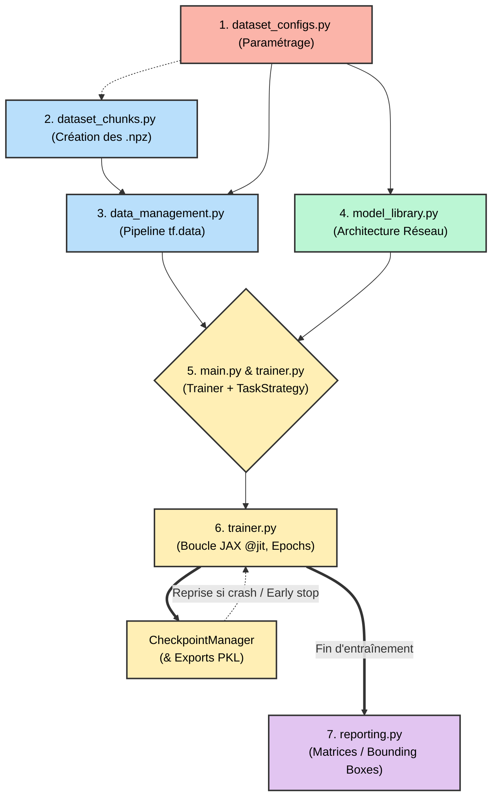

# 🧠 Architecture Globale du Pipeline JAX/Flax

Ce document décrit la "colonne vertébrale" du pipeline d'entraînement unifié. Quel que soit le type de tâche à venir (Classification, Détection d'objets, ou autre), le flux de données et l'orchestration de l'entraînement suivent rigoureusement les mêmes étapes. Toute spécialisation est déléguée via des patterns de conception (comme l'Injection de Dépendances avec les Stratégies).

---

## 🗺️ Représentation Graphique du Pipeline

---

## 1. Paramétrage Centralisé (`dataset_configs.py`)
L'intégralité du pipeline est pilotée par un dictionnaire de configuration unique. Aucune valeur critique ne doit être "codée en dur" dans l'architecture.
*   **Méthode clé :** `get_dataset_config(dataset_name)`
*   **Pilotage :** Le paramètre `task_type` (`"classification"` ou `"detection"`) informe le point d'entrée (`main.py`) de la stratégie à adopter. On y figure aussi les paramètres matériels pour Backend (TPU/GPU) relatifs au `micro_batch_size` et `learning_rate` etc.

## 2. Construction des Chunks (.npz) (`dataset_chunks.py` ou équivalent)
La lecture de milliers d'images individuelles depuis le disque ("en vrac") crée un goulot d'étranglement qui ralentit l'entraînement, surtout sur TPU.
*   **Objectif :** Pré-traiter (redimensionnement, passage éventuel en niveaux de gris) et agréger les images et labels dans de volumineux fichiers binaires Numpy `.npz` (les "chunks").
*   **Pilotage :** Guidé par l'`image_size` définie dans la configuration, ce format séquentiel assure une lecture rapide et consécutive vers la RAM.

## 3. Chargement et Pipeline des Datasets (`data_management.py`)
Préparation et mise en cache des données pour l'alimentation de la carte graphique / accélérateur tensoriel.
*   **Méthode clé :** `get_datasets(config, backend_config)`
*   **Objectif :** Charger les Chunks `.npz` stockés et créer un itérateur de données.
*   **Processus :**
    1. Chargement des images et de leurs cibles (Labels / Bounding Boxes) depuis les fichiers `.npz`.
    2. **Normalisation statique**  (Standardisation $Z$-score) via un fichier moyen/écart-type généré par le Chunking.
    3. Optionnel : Mise en cache RAM (`use_ram_cache=True`) si la mémoire physique est suffisante.
    4. Création via `tf.data.Dataset` pour activer l'augmentation dynamique (Data Augmentation spatiale : Flip, Crop, etc.) et le batching (`micro_batch_size`).

## 4. Création du Modèle (`model_library.py`)
Instanciation de l'architecture du réseau neuronal.
*   **Méthode clé :** `get_model(model_name, num_classes, dropout_rate)`
*   **Fonctionnement :** Une factorisation (Factory Pattern) se charge de retourner la classe `flax.linen.Module` requise (ex: ResNet, CNN pure) qui est totalement exempte de notion d'entraînement pour le moment.

## 5. Initialisation de l'Orchestrateur (`main.py` -> `trainer.py` & `task_strategies.py`)
L'organisateur (`Trainer`) doit être agnostique à la complexité de chaque tâche. Nous appliquons donc un pattern "Strategy" encapsulant la Logique Métier.
*   **Les Stratégies (`TaskStrategy`) :** Une classe (comme `ClassificationStrategy`) contenant toute l'*Intelligence* spécifique :
    *   `preprocess_batch` : Opérations sur Tensor dans la boucle JIT (ex: Mixup, One-Hot encoding).
    *   `compute_loss` : Fonction de coût (ex: Categorical Cross-Entropy vs Focal/Grid Loss).
    *   `compute_metrics` : Score (ex: Accuracy vs Loss Négative).
*   **Le Trainer (`Trainer`) :** Instancié avec le Modèle et la Stratégie (Injection de dépendance). 
    *   Crée un état immuable Flax (`TrainStateWithBatchStats`) liant Modèle, Poids, Statistiques de Batch Norm, et Optimiseur (AdamW avec planificateur d'apprentissage dynamique).
    *   Initialise le pont avec le système de sauvegarde (`CheckpointManager`).

## 6. La Boucle de Training / Epochs (`trainer.py`)
Le cœur d'exécution haute performance "compilé" sur le backend TPU/GPU via XLA (Accelerated Linear Algebra).
*   **Méthode clé :** `Trainer.train(train_dataset, val_dataset, ...)`
*   **Processus par Epoch :**
    1. **Train** : Appelle un JAX compilé `@jax.jit` déléguant les calculs mathématiques à la Stratégie. Accumulation de Gradients si le batch réel recherché est plus grand que le `micro_batch_size`.
    2. **Eval** : Validation du modèle congelé sur le dataset validatoire.
    3. **Sécurité RAM** : Appel proactif du Garbage Collector (Garbage monitoring `gc.collect()`) en inter-epochs.
    4. **Monitoring Temporel** : Sauvegarde immédiate dynamique des métriques pour traper les courbes X/Y de "Loss / Acc / LR" au format image (`TrainingVisualizer`).
    5. **Early Stopping et Backup** : Si le modèle performe (évaluation de `self.best_val_acc` pilotée par la stratégie), le `CheckpointManager` sauvegarde un cliché lourd (`_training_state.pkl`). En parallèle, la stratégie exporte la structure PKL minimale et portable optimisée pour l'inférence.

## 7. Reporting Final (`reporting.py` -> `task_strategies.py`)
Rendu visuel et bilans finaux pour juger de la pertinence de l'effort.
*   **Méthode clé :** `strategy.generate_reports(...)` appelée tout au bout du script `main.py`.
*   **Classification** : Production fine d'une **Matrice de Confusion** par le `ModelReporter` affichant l'Accuracy Globale, précisions Macros, F1-Scores Macros, etc.
*   **Détection** : Production de Traces Visuelles (Bounding Boxes) par le `DetectionReporter`, affichant les masques de vérité en rouge/vert sur le dernier test batch.
